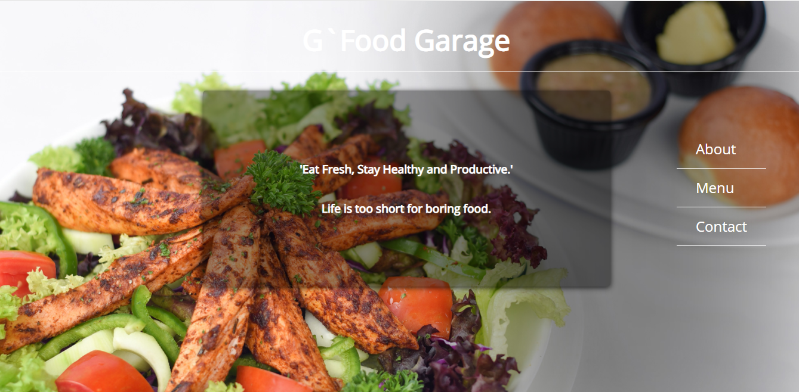
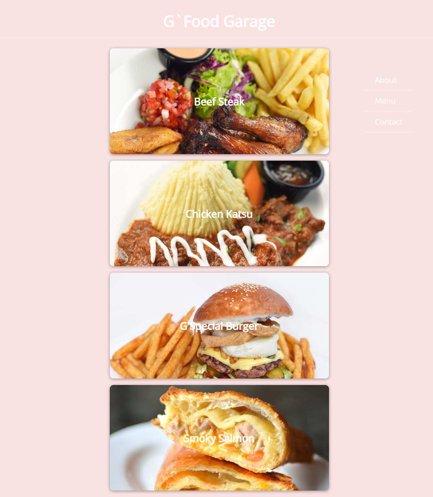

# Restaurant Page
Restaurant page is a simple page designed with help of Javascript and webpack. The purpose of this project is to help master the DOM manipulation and use of modules. The design of this page involved using Javascript to dynamically generate the DOM elements and the use of ES6 modules which help organize the code base.

### Home page snapshot


### Menu page snapshot


### Contact page snapshot


## Built With

- Javacript
- HTML
- CSS
- Webpack

## Live Demo

[Live Demo Link](https://gango-anan.github.io/restaurant-page/)


## Getting started
To get started:

### Clone the repo: 
```
$ git clone https://github.com/gango-anan/restaurant-page.git

```

## Setup and run the application
### Install node.js:
```
First install node.js for your system
```
### Next, navigate to the project folder and install the dependencies using the following command:
```
$ npm install
```
## Run 
```
Run the application by launching your local webserver and lauching the index.html file in the browser
http://127.0.0.1:5500/dist/index.html
```
## Author

Galiwango Ananiya

- GitHub: [@gango-anan](https://github.com/gango-anan) 
- Twitter: [@gango_anan](https://twitter.com/gango_anan) 
- LinkedIn: [@galiwango-ananiya](https://www.linkedin.com/in/galiwango-ananiya-0800821b4/) 

## 🤝 Contributing

Contributions, issues, and feature requests are welcome!

Feel free to check the [issues page](https://github.com/gango-anan/members-only/issues).

## Show your support

Give a ⭐️ if you like this project!

## Acknowledgments
- Standup team.
- Credit goes to TheOdinProject.


## 📝 License

This project is [MIT](https://github.com/gango-anan/restaurant-page/blob/master/LICENSE) licensed.
